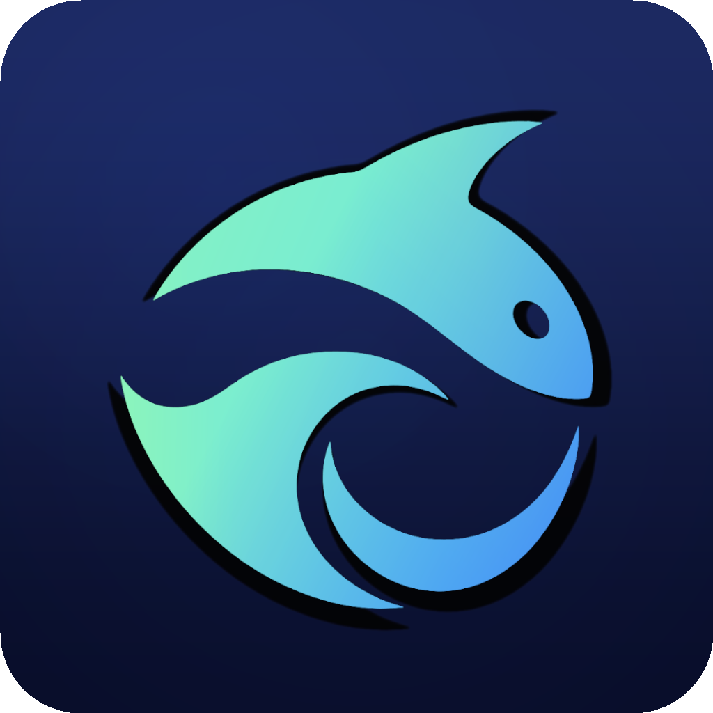

# ChatGPT自定义模型

独立的 macOS 启动器，可在模型配置面板中添加模型 ID，通过 CDP 注入 ChatGPT/Codex 的 renderer。用户选中后，客户端按该模型 ID 发起请求。

## 它做了什么

- 模型配置只需填写 `id`，界面显示和实际请求均使用该模型 ID。
- 插件启动时不启动或重启 ChatGPT/Codex；点击面板中的“保存并重启 ChatGPT”后，启用一个仅监听 `127.0.0.1` 的随机 Chromium 调试端口并应用配置。
- 通过 CDP 在 renderer 运行时补充 Statsig 白名单和模型列表响应。
- 插件启动后在 macOS 菜单栏显示应用图标，菜单提供“打开面板”和“退出”。
- 注入只存在于当前 ChatGPT/Codex renderer 的内存中。插件停止或删除后，正常重启 ChatGPT/Codex，之前注入的模型会全部丢弃；再次使用时，在插件面板中点击“保存并重启 ChatGPT”即可重新应用。

它不会修改 `ChatGPT.app`、`Codex.app`、`app.asar`、代码签名、API 密钥或历史会话。

## 赞助商

  

  <a href="https://choohub.net/"><strong>统一 AI 网关，稳定转发调用</strong></a> 
  ChooHub 为开发者提供统一的 AI 模型接入服务，通过一套配置即可在 ChatGPT/Codex 工作流中灵活切换所需模型，减少重复接入和环境维护成本，适合个人开发、团队协作与长期项目使用。

## 使用方法

请从 [GitHub Releases](https://github.com/felix5166/codex-model-unlocker/releases) 下载最新版本的 DMG，双击打开后将 `ChatGPT自定义模型.app` 拖入“应用程序”文件夹。

1. 确认 Codex 桌面端已经安装在 `/Applications/ChatGPT.app` 或 `/Applications/Codex.app`。
2. 双击 `ChatGPT自定义模型.app`，点击菜单栏图标，选择“打开面板”。
3. 添加模型 ID，点击“保存并重启 ChatGPT”，然后新建任务并打开模型选择器。
4. 需要停止插件时，点击 macOS 菜单栏中的插件图标，选择“退出”。

### 模型配置

点击菜单栏图标，选择“打开面板”，编辑模型 ID；使用加号添加模型，减号删除选中的模型。

- “保存”：只保存配置，点击“保存并重启 ChatGPT”后生效。
- “保存并重启 ChatGPT”：先保存配置，再重启 ChatGPT 并应用模型列表。

配置保存在 `~/Library/Application Support/CodexModelUnlocker/models.json`，属于本插件。首次使用时模型列表为空，请在面板中自行添加；升级插件不会覆盖已保存的配置。删除全部模型并点击“保存并重启 ChatGPT”后，自定义模型全部移除。

首次打开如果被 macOS 拦截：

1. 打开“系统设置”。
2. 进入“隐私与安全性”。
3. 往下滚动到“安全性”区域。
4. 找到“ChatGPT自定义模型.app 已被阻止”，点击“仍要打开”。
5. 输入 macOS 登录密码确认。

### 卸载

退出插件并删除 `ChatGPT自定义模型.app` 后，完全退出并正常重新打开 ChatGPT/Codex，此前注入的模型会全部消失。仅刷新页面或只关闭窗口不等于完全重启应用。

## 源码结构

| 文件 | 作用 |
| --- | --- |
| `CodexModelUnlocker` | `.app` 的启动入口，选择 Codex 内置 Node.js |
| `injector.mjs` | 读取模型、启动 Codex、连接本机 CDP 并维护注入状态 |
| `injection.js` | 在模型菜单出现时补充白名单与自定义模型选项 |
| `StatusMenu.swift` | Swift 原生菜单栏与模型配置面板 |
| `model-config.mjs` | 模型校验、配置读写与保存操作 |
| `models.json` | 首次使用的默认模型配置 |
| `Info.plist` | macOS 应用元数据 |
| `AppIcon.svg` | 应用图标源文件 |
| `build.sh` | 生成并临时签名 `.app` |
| `swiftc.sh` | Swift 编译入口，隔离旧工具链的重复模块定义 |
| `test.sh` | 源码和构建产物的静态检查 |

## 兼容性说明

这是针对 Codex 桌面端当前模型菜单结构的运行时适配。桌面端升级后如果改变 Statsig 配置键或 React 菜单结构，可能需要同步更新本项目。

## 免责声明

本项目是非官方的社区工具，与 OpenAI、Codex、ChatGPT 及任何中转服务商不存在隶属、授权或背书关系。项目只调整 Codex 桌面端运行时的前端模型可见性，不会提供或扩大任何账号、API、模型、付费功能或服务权限；模型出现在选择器中不代表对应服务一定可用。

使用第三方中转服务时，请自行评估其安全性、隐私政策和数据处理方式。API 密钥、提示词、文件及模型输出可能会经过该服务商的服务器，本项目无法控制或保证第三方服务的数据安全、稳定性、计费准确性及合规性。

使用者应自行确认其行为符合所在地法律法规，以及 OpenAI、Codex 和所使用服务商的条款。因安装、使用、修改或分发本项目导致的账号限制、数据泄露、费用损失、软件故障或其他直接、间接损失，项目作者及贡献者不承担责任。请在理解源码和风险后自行决定是否使用，并自行备份重要数据。

本项目按“现状”提供，不作任何明示或暗示的担保，包括但不限于适销性、特定用途适用性、兼容性和持续可用性担保。

## 许可证

本项目采用 [MIT License](LICENSE)。允许使用、复制、修改、分发和商用，但必须保留原始版权及许可证声明。软件按“现状”提供，不附带任何担保。
